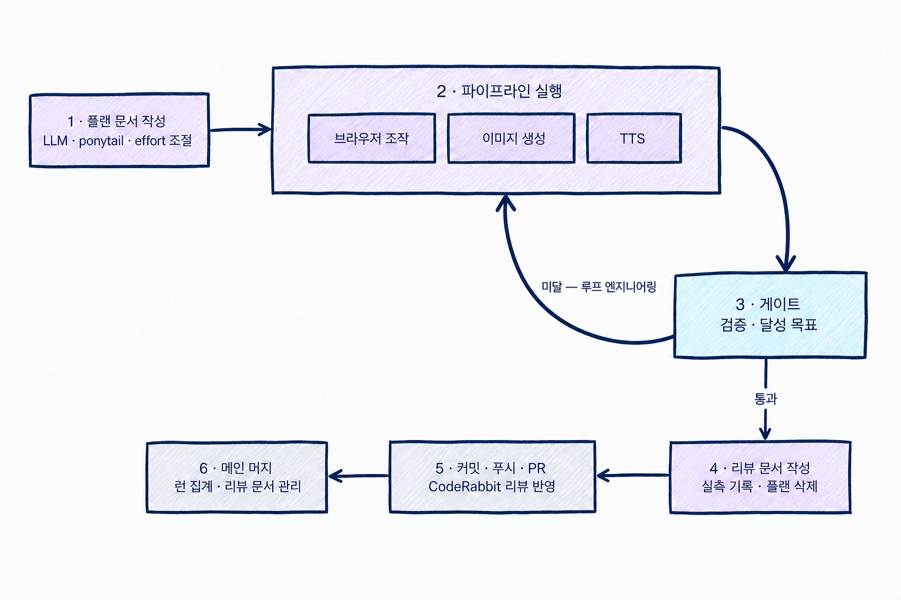
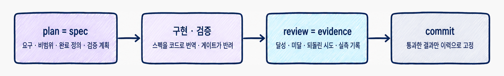
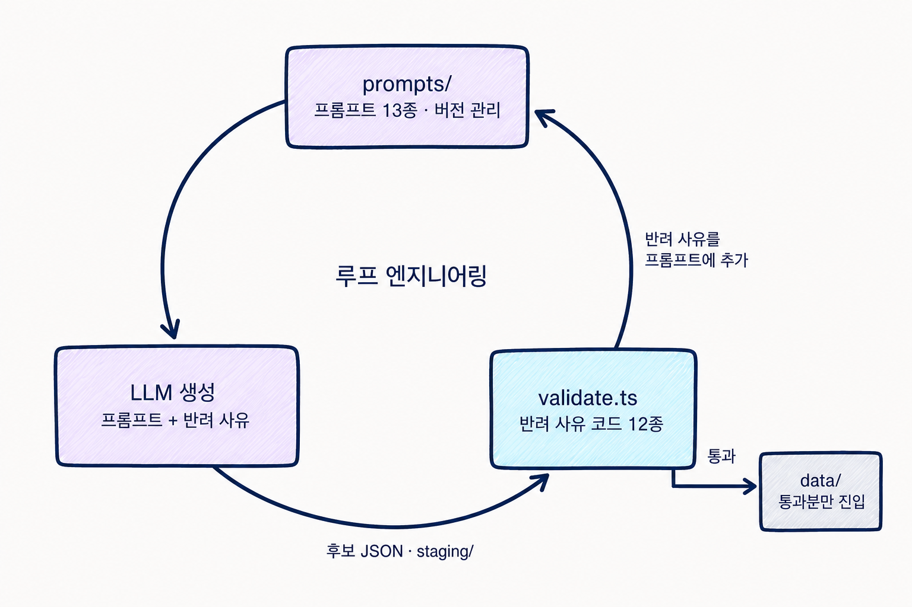
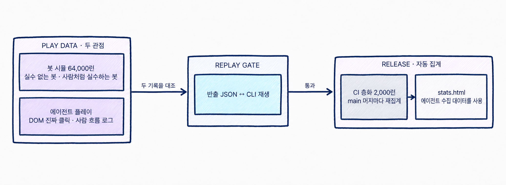
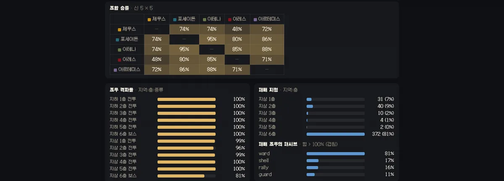
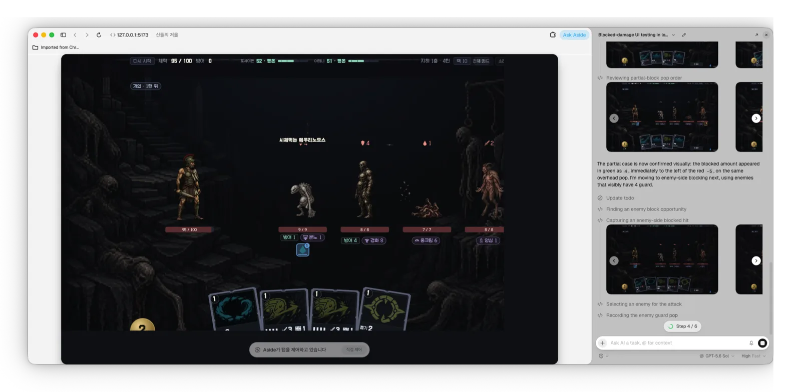
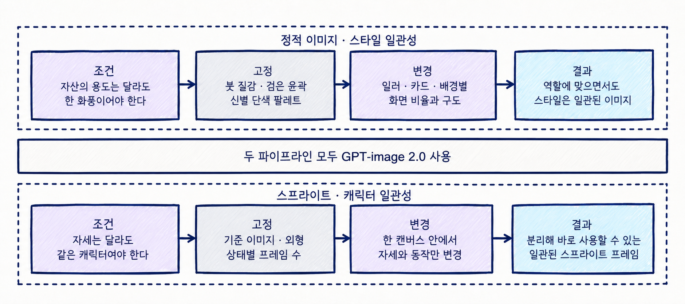
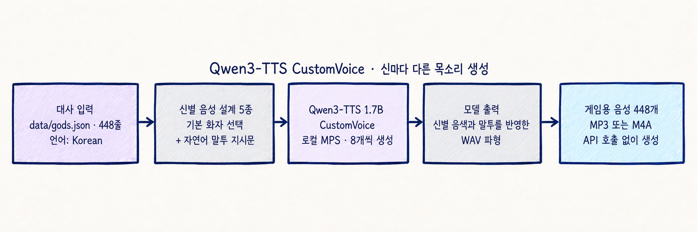
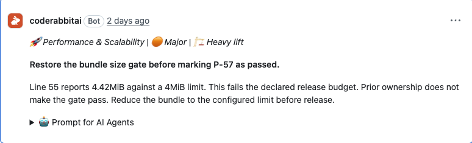

# 신들의 저울

두 신의 후원을 받아 지하 6층·지상 6층을 오르는 덱빌딩 로그라이크. 층마다 갈래가 셋이다.
과업을 맡으면 상대 신이 화를 내고, 달성하면 고른 신의 호의와 카드가 따른다.

NHN GAME X AI HACKATHON 사전 과제 — **7일, 1인 개발.** 이미지·음악·음성·코드·콘텐츠는 [명시한 외부 자산](ATTRIBUTION.md)을 제외하고 전부 LLM으로 생성했다.

**플레이:** <https://bongseop-kim.github.io/god-scales/>

```bash
npm install
npm run dev        # http://localhost:5173
```

## 7일 동안 남긴 데이터

| | |
|---|---|
| plan 소비 | 88건 — 리뷰 문서와 1:1 |
| CodeRabbit 지적 | 133건 · PR 15개 |
| 테스트 | 204개 · 조합 승률 게이트 포함 |
| 봇 시뮬 런 | 64,000 · 6회차 |
| AI 생성 에셋 | 538개 — 이미지·음성·영상 |
| LLM 토큰 | Claude 1.61B · Codex 201.6M |

## 어떻게 만들었나

**AI가 만들고, 게이트가 판정하고, 실패 결과를 반영해 통과할 때까지 다시 돌렸다.** 사람의 일은 게이트를 세우는 것이었다. 전체 이야기는 [submission/ai-tech.html](submission/ai-tech.html)([PDF](submission/ai-tech.pdf))에 있다.



### 스펙 주도 개발

`plans/NN-*.md`에 범위·완료 정의·검증 명령을 먼저 고정하고, 끝나면 `reviews/NN-*.md`에 실측 증거를 남긴 뒤 [plans-done/](plans-done/)으로 옮긴다. 게이트에 실패하면 구현을 고치지 성공 조건을 낮추지 않는다.



`CLAUDE.md`는 여섯 줄 헌법(`AGENTS.md`는 그 심링크)이고, 글쓰기(`WRITING.md`)·UI(`UI.md`)·배포(`DEPLOY.md`) 지침은 그 작업을 하는 턴에만 로드해 상시 컨텍스트를 작게 유지한다.

### 콘텐츠 생성 루프

카드 179장·적 19종을 LLM이 만들고 `validate.ts`가 스키마 오류·중복·죽은 데이터를 걸러낸다. 반려 사유는 프롬프트에 반영해 재생성 — 게이트를 통과할 때까지. 실측으로 제우스 카드 30장 중 10장이 반려·재생성됐고, 전 과정은 `logs/generation/`에 남는다.



### 플레이 데이터가 곧 밸런스 데이터

LLM 없는 스크립트 봇 두 종류와 LLM 브라우저 에이전트(aside)의 플레이가 `stats.html`에 모이고, 조합 승률 하한 하나가 밸런스 변경의 수락 여부를 판정한다.





브라우저 에이전트는 조작·측정을 DOM으로 하고, 사용자 눈에 보이는 최종 화면은 스크린샷을 찍어 직접 판정한다 — HUD·화면 버그 대부분이 사람 눈에 닿기 전에 여기서 잡혔다.



### 이미지 · 음성

이미지는 GPT-image 2.0 하나로 두 계약을 지킨다 — 정적 이미지(신·카드·배경)는 공통 화풍, 스프라이트는 한 캔버스에서 같은 캐릭터의 자세만 바꾼다.



음성은 신별 화자·말투 지시문을 넣어 Qwen3-TTS로 448줄을 로컬 생성했다.



### AI 상호 리뷰

커밋 전 ponytail 스킬이 군더더기를 덜어내고(테스트 픽스처 400줄 → 24줄), PR에서 CodeRabbit이 잘못을 잡는다.



## 한 런

시작하면 다섯 신 중 둘이 후원자로 붙는다. 12층을 오르며 길·카드·보상을 고르고, 두 신은 전투에 자동으로 개입한다.

| 결정 | 내용 |
|---|---|
| 갈림길 | 층마다 세 갈래. 다음 층은 **바로 옆 갈래**로만 갈 수 있고, 칸은 전투·정예·쉼터·과업 넷이다. 지역 전체가 처음부터 보인다 |
| 과업 | 과업 칸에서 두 신 중 하나를 따르거나 지나간다. 선택하면 상대 신의 호의가 −9(라이벌이면 −18) 내려가고, 다음 판정 가능한 전투 한 판에서 조건을 추적한다 |
| 개입 | 전투는 별도 선택 없이 시작한다. 두 신은 2턴째부터 3턴마다 현재 호의 단계에 맞춰 자동으로 행동한다. 분노 단계는 행동하지 않는다 |
| 훼방 | 분노 이하인 신은 다른 후원 신 카드의 피해·방어·연쇄를 1 낮춘다(바닥 1). 호의가 평온으로 돌아오면 즉시 풀린다 |
| 카드·표적 | 턴마다 에너지 3. 손패에서 낼 카드와 때릴 적을 고른다 |
| 전투 보상 | 후원 두 신의 카드 3장 중 하나를 덱에 넣거나 건너뛴다 |
| 과업 보상 | 과업을 달성하고 전투에서 이기면 고른 신의 호의가 +12 오르고, 그 신의 카드 후보 3장 중 하나를 추가로 얻는다 |
| 휴식 | 회복 · 덱에서 한 장 제거 · **덱의 한 장 강화** 3택. 강화는 `+1`·`+2`까지고 덱 장수는 그대로다 |
| 은혜 | 신이 헌신 단계에 있으면 전투 뒤에 **3택1**. 카드 한 장이 아니라 **그 슬롯(공격·방어·유틸·토큰)의 모든 카드**에 붙는다. 슬롯당 하나이고, 바꿔도 그 슬롯의 tier는 남는다 |

두 신의 은혜를 **각각 하나씩 받으면** 그 조합의 **합성 카드**가 열린다(10종에 각각 하나).

## 토큰

| 토큰 | 신 | 효과 |
|---|---|---|
| `shock` 감전 | 제우스 | 이번 턴 그 대상이 받는 피해 +1/스택. 턴 끝에 사라진다 |
| `displace` 축출 | 제우스·포세이돈 | 적의 턴 하나를 통째로 지운다 |
| `might` 위력 | 제우스·포세이돈 | 주는 피해 +1/스택. **소모되지 않고** 전투가 끝날 때까지 남는다 |
| `soaked` 침수 | 포세이돈 | 그 적의 다음 공격 −1 |
| `bulwark` 성벽 | 아테나 | 전투가 끝날 때까지 남는 방어 |
| `deflect` 반사 | 아테나 | 공격 한 방을 막고 그대로 되돌린다 |
| `bleed` 출혈 · `frenzy` 광란 | 아레스 | 턴마다 도트 · 다음 공격 +2 |
| `mark` 표식 · `crit` 치명 | 아르테미스 | 그 적이 1.5배로 맞는다 · 다음 공격 2배 |

## 명령어

```bash
npm test                                   # 단위 테스트 + 조합 승률 하한
npm run build                              # tsc --noEmit + vite build
npm run sim -- --runs 2000 --stratified    # 10조합 균등 시뮬
npm run sim -- --replay <반출파일>          # 반출한 런을 CLI에서 재생
npm run e2e -- --dist                      # 빌드 산출물을 브라우저로 완주 (Aside 필요)
npm run validate -- <파일>                  # 카드·적·과업·층 배치 게이트
npm run tune                               # 조합별 승률 ε=0 · ε=0.45 비교표 (3,000런 × 2, 8초)
```

## 문서

| | |
|---|---|
| [submission/ai-tech.html](submission/ai-tech.html) | AI 활용 기술 문서 — 워크플로·파이프라인 전체 |
| [CARDS.md](CARDS.md) | 배포된 카드 전체 — `npm run cards`가 데이터에서 만든다 |
| [DEPLOY.md](DEPLOY.md) | 배포 절차와 게이트 |
| [reports/final.md](reports/final.md) | 회차별 밸런스 리포트 · B-0 판정 |
| [reviews/00-index.md](reviews/00-index.md) | 실행 계획 전체 리뷰 |
| [decisions/](decisions/) | LLM 에이전트 런 기록 |
| [ATTRIBUTION.md](ATTRIBUTION.md) | 에셋 출처 |
