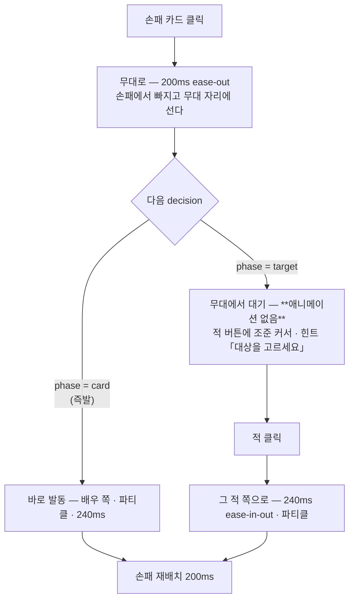

# P-41 · 카드 면 — 값이 먼저 읽히고, 손이 부채꼴로 서고, 발동이 두 단이다

`plans/41-cardface.md` · [◀ P-40](40-free.md) · [색인](../reviews/00-index.md) · [R-26](../reviews/26-hud.md) · [R-33](../reviews/33-icons.md)

**크기** 중간~큼 · **착수 조건** 없음. [P-38](38-patron.md)이 `ui/app.tsx`를 쓰지만 그쪽은 시작 화면이고 이쪽이 `app.tsx`에서 고치는 것은 `.used-cards` 한 자리다

**범위** 카드 면(§1) · 부채꼴(§2) · 발동 두 단(§3) · **전투 화면의 나머지 모션(§5)**. §5는 따로 세울 계획이 아니라 여기에 흡수한 것이다 — 같은 파일 넷(`ui/combat.tsx` · `ui/tokens.tsx` · `ui/motion.css` · `ui/style.css`)을 두 번 열 이유가 없다. **지도·화면 전환 모션은 [P-42](42-mapwalk.md)가 든다**

[R-26](../reviews/26-hud.md)이 배우 위를 고치고 [R-33](../reviews/33-icons.md)이 아이콘 28개를 붙였다. **카드는 그 둘을 안 받았다.** 지금 손패 한 장은 이렇게 나간다(`ui/card.tsx:75-84`):

```
┌ 프레임색 = 신 ─────────┐
│      [일러 4:3]        │
│  감전 타격              │  1rem 흰색 · nowrap + ellipsis
│  1 에너지 · 피해 4 · 감전 1 │  0.6rem(9.6px) #858c9e 한 줄
└────────────────────────┘  ≈104px, 열 폭 따라 늘어남
```

**효과가 카드의 본체인데 카드에서 제일 안 보이는 것으로 그려져 있다.** 비용은 문장 앞에 텍스트로 묻혀 있고, 「감전 1」은 적 머리 위 38px 배지와 같은 사실인데 표기가 두 벌이다.

---

## 완료 정의

**카드를 안 배우고도 낼 수 있고, 클릭이 두 번인 이유가 화면에 있다.**

```bash
npx tsc --noEmit && npm test
npm run build
npm run e2e                              # 여덟 화면 레이아웃 + 12층 완주 + 반출 재생 일치
```

| 항목 | 판정 기준 |
|---|---|
| 비용 | 129장 전부 **같은 픽셀**(좌상단 원)에 있다. 효과문에서 「에너지」가 사라진다 |
| 위계 | 효과 숫자가 카드에서 제일 큰 글자다. 이름은 캡션으로 내려간다 |
| 아이콘 | `damage`·`block`·`heal`과 토큰 10종이 **배우 위 배지와 같은 글리프**다. 새로 그린 것 0 · 요청 0회 |
| 크기 | 카드가 **고정 폭**이다. 열 폭·손패 수가 카드 크기를 안 바꾼다 |
| 부채꼴 | 손패가 겹쳐 한 줄로 선다. 1장이면 안 기운다. 10장이어도 한 줄이다 |
| 발동 | 대상이 필요한 카드는 **무대에서 기다리고**, 파티클이 두 번째 클릭에 튄다 |
| 토큰 | 배지가 **붙는 순간이 보인다**. 스택이 1 → 2로 오르는 것도 |
| 죽음 | 적이 사라질 때 목록이 덜컥 올라오지 않는다 |
| 단계 | 우호도가 단계 경계를 넘는 순간이 화면에 있다 |
| 미터 | 체력·호의 미터가 `width`가 아니라 `transform`으로 움직인다 |
| 게이트 | `npm run e2e`의 `overflowX` false · 12층 완주 · 반출 재생 일치 |

**밸런스는 안 잰다.** 규칙·값·데이터를 하나도 안 건드린다 — [R-26](../reviews/26-hud.md)·[R-33](../reviews/33-icons.md)과 같은 자리다.

---

## 설계

### 1 · 카드 면 — 채널 넷, 고정 폭

관례는 어느 카드 게임을 봐도 같다(Slay the Spire · Hearthstone · MTG · Balatro): **비용은 좌상단 고정 원, 숫자가 제일 크고, 이름은 작다.**

```
┌───────────────────────────┐  --card-w: 140px (고정)
│ ⟨3⟩              [파워]   │  좌상단 비용 젬 · 우상단 예외 배지 (일러 위 겹침 · 세로 0px)
│                           │
│      일러 4:3 · 프레임색=신 │
│                           │
├───────────────────────────┤
│   ⚔ 8      ⚡ 2           │  아이콘 18px + 숫자 1.05rem 굵게  ← 카드의 본체
│   감전 타격                │  0.78rem #9298aa               ← 캡션
└───────────────────────────┘
```

| 채널 | 싣는 것 | 근거 |
|---|---|---|
| 좌상단 원 | 비용 (값은 1·2·3뿐) | 손패에서 제일 많이 스캔하는 값. 못 내면 **젬만 빨강** — 지금은 대상 선택 중과 똑같이 0.45로 흐려진다 |
| 우상단 배지 | `파워` / `전체` | 129장 중 **15장**뿐이다(파워 5 · 전체 10, 데이터상 안 겹친다). 예외만 적는다 |
| 가운데 | 일러 + 프레임색 | **그대로.** [R-37](../reviews/37-wire.md)이 붙인 그림 30장과 청동 프레임 한 장이 그대로 선다 |
| 효과 줄 | 아이콘 + 굵은 숫자 | 있는 시트에서 꺼낸다 |
| 캡션 | 이름 | 이름 최대 7자다. 0.78rem이면 `nowrap` + ellipsis가 필요 없어진다 |

**아이콘은 하나도 안 그린다.** `art/icons.svg`의 28개로 다 덮인다:

| op | 횟수 | 아이콘 |
|---|---|---|
| `damage` | 82 | `#icon-damage` — 적 의도가 쓰는 그것 |
| `apply_token` | 70 | **그 토큰 자신의 아이콘.** 「감전」 카드와 적 머리 위 배지가 같은 글리프가 되는 자리다 |
| `block` | 39 | `#icon-block` |
| `heal` | 13 | `#icon-heal` |
| `draw` 25 · `energy` 10 · `chain` 10 · `self_damage` 7 · `favor_shift` 2 | 54 | **아이콘 없다. 짧은 한글 그대로** — 「뽑기 1」 |

MTG가 마나 심볼과 문장을 한 줄에 섞는 것과 같다. 다섯 op 때문에 아이콘을 새로 요청하지 않는다 — [R-33](../reviews/33-icons.md)의 「그린 것 0 · 요청 0회」를 깨는 값이 아니다.

`self_damage`만 경고색(`#eb887d`)이다 — 그 줄은 내가 손해 보는 줄이다. `when` 조건부 효과 4장은 그 줄만 `opacity: .6`으로 물러난다(문구는 `title`이 든다).

**고정 폭이 부채꼴의 전제다.** 겹치려면 폭을 알아야 한다. 지금 `.hand`의 `repeat(auto-fill, minmax(96px, 1fr))` + `.game-card { width: 100% }`는 열 폭에 따라 카드가 늘었다 줄었다 한다 — 같은 카드가 보상 화면과 전투 화면에서 다른 크기다.

```css
:root { --card-w: 140px; }
.game-card { width: var(--card-w); }
.hand { display: flex; flex-wrap: wrap; gap: 8px; }   /* auto-fill 격자를 뺀다 */
```

### 2 · 부채꼴 — 두 겹이어야 하는 이유가 있다

**바깥 래퍼가 자세를 들고, 안쪽 카드가 모션을 든다.**

| 겹 | 무엇 | transition |
|---|---|---|
| 래퍼 `.fan > *` | `rotate(var(--a))` — 부채꼴 각도 | **없다.** 정적 자세다 |
| 카드 `.game-card` | hover 리프트 · press 스케일 | 140ms `--ease-out` |

한 겹으로 만들면 `ui/motion.css`에 이미 있는 이 한 줄이 부채꼴을 통째로 편다:

```css
@media (prefers-reduced-motion: reduce) { button:active, .choice:hover, .game-card:hover { transform: none; } }
```

부채꼴 각도는 모션이 아니라 **배치**다. reduced-motion에서도 남아야 한다.

**호는 계산하지 않는다.** `transform-origin`을 카드 아래로 내리면 회전 하나가 호를 만든다 — `pow()`도 `abs()`도 필요 없다.

```css
.fan { display: flex; justify-content: center; padding-top: 18px; }
.fan > * {
  --a: calc((var(--i) - (var(--n) - 1) / 2) * min(6deg, 34deg / var(--n)));
  transform-origin: 50% 320%;          /* 카드 아래 한 점 = 부채의 축 */
  transform: rotate(var(--a));
  z-index: var(--i);
  margin-left: calc(-1 * max(18px, (var(--card-w) * var(--n) - 100%) / (var(--n) - 1)));
}
.fan > :first-child { margin-left: 0; }
```

- `--i`(인덱스)·`--n`(손패 수)만 React가 인라인으로 넣는다. 기하는 전부 CSS다
- **`--n: 1`이면 각이 0이다** — `(1-1)/2 = 0`. 한 장짜리 손패가 기울면 버그로 읽힌다. 겹침도 `:first-child`가 0으로 덮는다(0으로 나누는 `calc`는 무효가 되고 그 규칙이 남는다)
- `100%`는 `.fan`의 폭이다. **겹침을 열 폭에서 역산하므로 10장이어도 한 줄이다** — 지금 격자는 5열이라 10장이면 두 줄이고 세로 262px를 먹는다. 부채꼴은 그보다 짧다
- 겹침 하한 18px — 손이 작을 때 억지로 안 붙인다

hover(`@media (hover: hover) and (pointer: fine)` 안에서만, 지금도 그렇게 되어 있다):

```css
.fan > *:hover { z-index: 99; }
.fan .game-card:hover { transform: translateY(-16px) scale(1.06); }
```

래퍼가 이미 기울여 놨으므로 카드는 들어올리기만 한다. **140ms `--ease-out`, `transition`이지 `keyframes`가 아니다** — 손패 위를 빠르게 훑으면 중간에 목표를 갈아타야 한다. `transform`·`opacity`만 쓴다.

### 3 · 발동 두 단 — 무대가 하나 선다

지금 `answer()`는 **클릭 즉시 파티클을 튀긴다**(`ui/combat.tsx:110-117`). 대상을 고르는 카드도 그렇다 — 아직 아무 일도 안 일어났는데 이펙트가 먼저 난다.

상태는 이미 엔진에 있다. `sim/engine.ts:289-294`:

```ts
const targets = card.target === "enemy" ? living().map(({ id }) => id) : [];
const target = targets.length
  ? yield { phase: "target", options: targets, observation: { card: cardId, ...observation() } }
  : undefined;
```

**`view.card`는 카드 id다**(이름이 아니다). 지금 `ui/combat.tsx:167`이 그것을 그대로 문장에 넣으므로 화면에 `card_zeus_01 · 대상을 고르세요`가 뜬다 — **이 계획이 같이 고치는 버그 하나다.** 그리고 그 시점에 카드는 `state.combat.hand`에서 아직 안 빠졌다(`playCard`는 target을 받은 뒤 돈다).



**UI가 예측하지 않는다.** `card.target === "enemy"`로 미리 갈라보고 싶지만 **적이 하나면 엔진이 target 단계를 건너뛴다**(`targets.length`가 0은 아니지만 자기 카드는 0이고, 단독 적은 옵션이 하나여도 단계가 선다 — 두 분기가 데이터로만 갈린다). 예측하면 그 자리가 어긋난다. **클릭은 언제나 「손 → 무대」 하나**이고, 즉발은 무대에 머무는 시간이 0인 경우다. 코드 경로가 하나다.

| 단 | 시간 | easing | 근거 |
|---|---|---|---|
| hover 리프트 | 140ms | `--ease-out` | 하루 수십 번 도는 자리라 짧게 |
| press | 100ms `scale(.97)` | `--ease-out` | 이미 있다(`ui/motion.css`) |
| 손 → 무대 | 200ms | `--ease-out` | 들어오는 것 |
| **무대 대기** | 무한 | — | **애니메이션을 넣지 않는다.** 맥동·발광 루프는 사람이 결정하는 내내 도는 장식이다. 정지가 「너를 기다린다」다 |
| 무대 → 대상 | 240ms | `--ease-in-out` | 화면 위 이동 |
| 파티클 | 기존 `playSprite` | — | 자리만 옮긴다 — **발동하는 클릭에** |
| 손패 재배치 | 200ms | `--ease-out` | `motion`의 `layout`. 라이브러리는 이미 있다 |

전부 300ms 미만이고 `transform`·`opacity`만 움직인다. reduced-motion에서는 **무대 자리는 남고 이동만 없앤다** — 무대는 정보지 장식이 아니다. 파티클은 이미 `!reducedMotion`으로 막혀 있다(`ui/combat.tsx:115`).

### 4 · e2e 드라이버가 카드 문구를 파싱한다 — 여기서 조용히 깨진다

`tools/e2e.ts:66-68`:

```js
const caption = (button) => button.querySelector("small")?.textContent ?? "";
const cardCost = (button) => Number(caption(button).match(/^(\d+) 에너지/)?.[1] ?? -1);
const cardDamage = (button) => [...caption(button).matchAll(/(?:피해|연쇄) (\d+)/g)]...
```

비용을 젬으로 옮기는 순간 `cardCost`가 129장 전부 **-1**을 돌려준다. **e2e는 실패하지 않는다** — 드라이버가 id 순으로 카드를 낼 뿐이고 12층은 그대로 완주한다. 통과한 게이트가 다른 것을 재고 있게 된다.

`data-cost`·`data-damage`를 버튼에 얹고 드라이버가 그것을 읽는다. **화면 문구를 파싱하는 자리가 하나 사라지는 것이 덤이다** — `card_zeus_04 축전`처럼 효과가 「에너지 2」인 카드 10장은 지금도 정규식이 우연히 맞을 수 있는 자리였다.

### 5 · 전투 화면의 나머지 모션 — 지금 정보가 사라지는 세 자리

카드만 고치고 나가면 같은 화면을 두 번 열게 된다. **연출을 늘리는 것이 아니라, 이미 일어나는 일인데 화면에 흔적이 없는 자리만** 넣는다.

#### 5.1 토큰 배지가 붙고 빠지는 순간

`ui/tokens.tsx`에 `motion`이 없다. [R-26](../reviews/26-hud.md)이 「내게 무엇이 붙었나」를 위해 만든 줄인데 **붙는 순간이 안 보이고**, 감전 1 → 2도 20px 원 안의 글자 하나가 바뀔 뿐이다.

- `TokenRow`를 `AnimatePresence`로 감싼다. 등장 `{ opacity: 0, scale: .85 } → 1`, 퇴장 `{ opacity: 0, scale: .9 }`, **160ms `--ease-out`**
- 스택 숫자는 `key={stacks}`로 다시 마운트시켜 짧게 튄다(`scale: 1.25 → 1`, 140ms) — `DamagePop`이 `hitSeq`를 key로 쓰는 것과 같은 수법이다(`ui/combat.tsx:44`)
- **`ui/motion.css`에 죽은 규칙이 있다**: `.token-badge { transition: transform 160ms, opacity 160ms }` — 그 두 속성을 건드리는 규칙이 아무 데도 없다. 이 절이 비로소 그것을 쓴다
- 배지는 적 셋 × 최대 4개 + 플레이어 = 한 화면에 13개까지다. `scale`·`opacity`만 쓴다

#### 5.2 적이 죽는 순간

`ui/combat.tsx:127`의 적 목록은 그냥 `map`이다. 셋이 둘이 되면 **화면이 덜컥 올라오고 고장으로 읽힌다.**

- 적 목록을 `AnimatePresence`로 감싸고 버튼에 `layout`을 붙인다. 퇴장 `{ opacity: 0, scale: .92 }` **180ms**
- `layout` 하나가 재배치까지 같이 든다 — [P-36](36-shove.md) §4가 밀어내기 때문에 어차피 붙일 자리다. **여기서 먼저 서면 그쪽은 규칙만 넣으면 된다**
- 퇴장 중인 적 버튼은 `disabled`다. `tools/e2e.ts:53`이 「퇴장 중인 옛 화면도 클릭될 수 있다」를 방어하는 자리와 같다 — `pointer-events: none`을 exit에 건다

#### 5.3 우호도가 단계 경계를 넘는 순간

`FavorMeter`(`ui/combat.tsx:237`)는 색만 바뀐다. **그 순간 신의 행동이 바뀐다** — 진노는 조우 시작과 전투 중 개입이 둘 다 달라진다(`core/favor.ts`).

- `favorStage(value)`가 바뀌면 그 미터만 한 번 강조한다. 테두리 `box-shadow` 펄스 **220ms 한 번**, 루프 아님
- 런당 몇 번뿐이다 — animation-craft의 「드묾 → delight 허용」에 드는 전투 중 유일한 자리다
- **진노 진입만 조금 더 세게.** 그 단계가 다음 조우 시작에 터지므로 들어서기 전에 읽혀야 한다(`ui/style.css:184`가 이미 색으로 말하는 것과 같은 이유)

#### 5.4 미터 둘이 `width`를 애니메이션한다 — 추가가 아니라 수정

```css
.enemy .hp i   { transition: width 200ms var(--ease-out); }   /* ui/style.css:158 */
.favor .meter i { transition: width 200ms var(--ease-out); }  /* ui/style.css:178 */
```

`width`는 매 프레임 layout + paint다. `transform: scaleX(var(--fill))` + `transform-origin: left`로 바꾼다 — 두 줄이고 GPU로 간다. `prefers-reduced-motion`의 `transition: none`은 그대로 둔다.

#### 5.5 안 하는 것

| 자리 | 이유 |
|---|---|
| 에너지·방어·뽑을 카드 숫자 펄스 | 카드 낼 때마다 숫자 넷이 튄다 — 하루 수십 회는 축소 대상이다. 지불 피드백은 §1의 비용 젬이 든다 |
| 보상·은혜·요구 3택1 stagger | 40ms면 공짜지만 정보가 0이다 |
| 무대 대기 맥동 | §3에서 이미 거절했다 |
| 파워 줄 등장 | 파워는 5장뿐이고 §5.1과 같은 값을 두 번 만드는 것이다. 토큰이 실제로 읽히는지 보고 나서 |

### 6 · 배선

| 자리 | 무엇 |
|---|---|
| `ui/card.tsx` | `GameCard`의 `caption: string` → `card?: CardView`. 젬·예외 배지·효과 줄·캡션. `data-cost`·`data-damage` |
| `ui/card.tsx` | op → 아이콘 표 하나. `apply_token`은 토큰 자신의 아이콘(`ui/tokens.tsx`의 표와 같은 이름) |
| `ui/card.tsx` | **`effectText`는 그대로 둔다** — `ui/header.tsx:24`(개입문)와 `ui/choices.tsx:85`(은혜)가 문자열로 쓴다. 구조화는 카드 면 안에서만 |
| `ui/style.css` | `--card-w`, `.game-card` 격자 재배치, `.cost-gem`, `.card-kind`, `.card-fx`, `.hand` flex, `.fan` |
| `ui/motion.css` | 부채꼴 두 겹, hover 140ms, 무대 전이, 배지 등장, 단계 펄스, reduced-motion에서 **회전은 남기고 이동만** |
| `ui/combat.tsx` | `.fan` + `--i`·`--n`, 무대 카드(`view.card`), 파티클을 발동 클릭으로, 힌트의 id → 이름 |
| `ui/combat.tsx` §5.2 | 적 목록 `AnimatePresence` + 버튼 `layout`, 퇴장 중 `pointer-events: none` |
| `ui/combat.tsx` §5.3 | `FavorMeter`가 단계 변화를 감지해 한 번 펄스 |
| `ui/tokens.tsx` §5.1 | `TokenRow` `AnimatePresence`, 스택 숫자 `key={stacks}` |
| `ui/style.css` §5.4 | 미터 둘 `width` → `scaleX` + `transform-origin: left` |
| `ui/app.tsx` | `.used-cards` 한 자리 — 고정 폭 카드가 3열 격자에 안 들어간다(§함정 3) |
| `tools/e2e.ts` | `cardCost`·`cardDamage`가 `dataset`을 읽는다 |
| `test/ui.test.ts` | 젬·아이콘·무대 카드 |

**엔진·규칙·데이터는 안 건드린다.** `globalParamVersion`·`botPolicyVersion` 그대로다.

---

## 함정

1. **reduced-motion의 `transform: none` 한 줄이 부채꼴을 편다.** 두 겹으로 나누는 유일한 이유다. 한 겹으로 짜면 접근성 설정을 켠 사람에게만 레이아웃이 다르게 나가고, 그걸 아무도 안 본다
2. **e2e가 조용히 깨진다**(§4). `data-cost`를 같은 커밋에 넣는다 — 나중에 하면 그 사이 e2e 결과가 전부 다른 것을 잰 값이다
3. **`.hand`를 보상·카드 제거도 쓴다**(`ui/reward.tsx:23`, `ui/choices.tsx:55`). **부채꼴은 `.fan`을 단 전투 손패만이다** — 3택1은 고르는 격자지 손이 아니다. 고정 폭은 셋 다 받는다
4. **`.used-cards`는 `repeat(3, 1fr)` 격자다**(`ui/style.css:205`). 결과 화면 열이 ~410px이라 칸이 120px인데 카드가 140px이면 넘친다. `flex-wrap`으로 바꾸거나 그 자리만 `--card-w`를 줄인다
5. **무대 카드를 예측하지 마라.** 두 분기는 `card.target`과 살아 있는 적 수로만 갈린다 — UI가 다시 판정하면 엔진과 두 번째 진실이 생긴다. 다음 `decision.phase`만 본다
6. **무대 대기에 루프 애니메이션을 넣지 마라.** 맥동하는 카드는 사람이 적을 고르는 내내 시야에서 움직인다
7. **`view.card`는 id다.** 지금 화면에 `card_zeus_01 · 대상을 고르세요`가 뜨고 있다 — 무대 카드를 세우면 그 문장은 사라지지만, 힌트를 남긴다면 이름으로 바꿔야 한다
8. **세로는 게이트가 안 잰다.** `tools/e2e.ts`의 `box`는 `left`·`width`·`gapRight`만 재고 `overflowX`는 가로만 본다. [R-26](../reviews/26-hud.md)의 900px는 사람이 본 값이다 — 140px 카드는 세로 ~176px이라 지금(104px 카드 한 줄 ~131px)보다 45px 크다. **대신 부채꼴이 10장을 한 줄로 접으므로 손이 클 때는 오히려 짧아진다.** 1440×900에서 눈으로 확인하고 리뷰에 적는다
9. **`.decision-panel`은 `overflow: visible`이어야 한다.** hover 리프트와 무대가 패널 밖으로 나간다. 지금 `position: relative`뿐이니 그대로 두면 된다 — 부채꼴이 넘친다고 `overflow: clip`을 걸면 들어올린 카드의 위가 잘린다
10. **`AnimatePresence`가 죽은 적을 DOM에 180ms 남긴다.** `tools/e2e.ts:52`의 `enabled()`는 `!el.disabled`만 본다 — 퇴장 중인 적 버튼이 `disabled`가 아니면 드라이버가 **죽은 적을 대상으로 고르고** `advance`가 1초 헛돈다. 퇴장에 `disabled`를 같이 건다
11. **`scaleX`는 안쪽 글자를 같이 늘인다.** `.enemy .hp small`은 `.hp i`의 형제라 무해하지만(`ui/style.css:157-159`), 채움 막대 안에 글자를 넣는 순간 깨진다. 지금 구조를 유지한다
12. **단계 펄스를 `useEffect`로 걸면 첫 렌더에 한 번 터진다.** 전투에 들어설 때마다 미터 둘이 번쩍인다 — 직전 단계를 `useRef`에 들고 **바뀐 경우에만** 돈다
13. **`layout`은 부채꼴과 다른 층이다.** 적 버튼의 `layout`과 손패 래퍼의 `rotate`가 같은 요소에 겹치면 `motion`이 transform을 덮어쓴다. 적 쪽에만 붙이고 손패는 §2의 두 겹을 그대로 둔다

---

## 다음 자리

1. **드래그로 낸다.** 카드를 적 위로 끌어다 놓는 것 — 무대 두 단이 이미 그 상태 기계다(`잡음 → 조준 → 놓음`). `setPointerCapture` + 속도 기반 판정이 필요하고, 그건 이 계획의 세 배다
2. **공격/스킬 타입 칩.** 관례는 전 카드에 적지만 140px에서는 배지 슬롯이 하나뿐이라 파워·전체에 줬다. 대상 선택이 놀라움으로 나오면 그때
3. **카드 확대 보기.** 길게 누르면 카드 한 장이 크게 뜬다 — 효과 줄을 두 줄로 접는 카드 19장(효과 3~4개)이 그 근거를 만들면
4. **적 턴이 한 프레임에 끝난다.** 「턴 종료」를 누르면 적 셋의 행동이 엔진 한 스텝에서 다 돌고, 플레이어는 **합계 하나**로 본다 — 누가 얼마나 때렸는지 알 수 없다. 전투에서 제일 큰 학습비용이지만 **연출로 못 고친다**: `playEncounter`가 적 행동 사이에 `yield`를 안 한다. 관측 스텝을 넣으면 리플레이·CLI 재생·`data-step`이 다 움직인다 — 별도 계획 크기다

---

## 세션 종료

- [ ] `ui/card.tsx` — `card?: CardView`, 비용 젬, 파워/전체 배지, 아이콘 효과 줄, 이름 캡션, `data-cost`·`data-damage`
- [ ] `ui/card.tsx` — op→아이콘 표(`apply_token`은 토큰 아이콘), 아이콘 없는 다섯 op는 한글, `self_damage` 경고색, `when`은 `opacity .6`
- [ ] `ui/style.css` — `--card-w: 140px` 고정, `.hand` flex, `.cost-gem`(못 내면 빨강), `.card-kind`, `.card-fx`
- [ ] `ui/motion.css` — `.fan` 래퍼 회전(`transform-origin: 50% 320%`) · 카드 hover 140ms · reduced-motion에서 회전 유지
- [ ] `ui/combat.tsx` — `.fan` + `--i`/`--n`, 무대 카드, 파티클을 발동 클릭으로, 힌트 id→이름
- [ ] `ui/app.tsx` — `.used-cards`가 고정 폭 카드를 받게
- [ ] `ui/tokens.tsx` — `TokenRow` `AnimatePresence` 160ms, 스택 `key={stacks}` 튐 140ms (§5.1)
- [ ] `ui/combat.tsx` — 적 목록 `AnimatePresence` + `layout` 180ms, **퇴장에 `disabled`** (§5.2 · 함정 10)
- [ ] `ui/combat.tsx` — `FavorMeter` 단계 변화 펄스 220ms 한 번, 직전 단계는 `useRef` (§5.3 · 함정 12)
- [ ] `ui/style.css` — `.enemy .hp i`·`.favor .meter i`를 `width` → `scaleX` (§5.4)
- [ ] `tools/e2e.ts` — `cardCost`·`cardDamage`가 `dataset` 읽기
- [ ] `test/ui.test.ts` — 젬에 비용 · 효과 아이콘 · 무대 카드 · 부채꼴 1장에서 각 0 · 퇴장 중인 적 버튼이 `disabled`
- [ ] `npx tsc --noEmit` · `npm test` · `npm run build` · `npm run e2e`(`overflowX` false · 12층 완주 · 반출 재생 일치)
- [ ] 1440×900에서 손패 1·5·10장을 눈으로 본다 — 세로는 게이트가 안 잰다(함정 8)
- [ ] `reviews/41-cardface.md` 작성 후 이 파일 삭제
