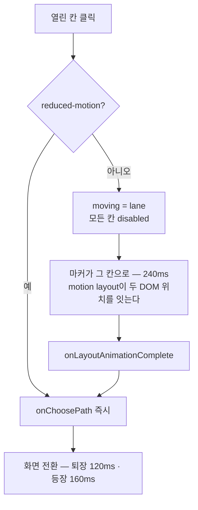

# P-42 · 지도를 걷는다 — 칸을 누르고, 마커가 가고, 그 다음에 화면이 넘어간다

`plans/42-mapwalk.md` · [◀ P-41](41-cardface.md) · [색인](../reviews/00-index.md) · [R-27](../reviews/27-map.md) · [R-37](../reviews/37-wire.md)

**크기** 중간 · **착수 조건** 없음. [P-41](41-cardface.md)과 파일이 `ui/app.tsx`·`ui/motion.css`·`tools/e2e.ts` 셋에서 겹친다 — **P-41을 먼저 끝내고 시작한다**(그쪽이 `.used-cards`와 `cardCost`를, 이쪽이 `MapScreen`과 `path` 분기를 건드려 같은 함수가 아니지만 같은 파일이다)

[R-27](../reviews/27-map.md)이 12층 × 3갈래 격자를 만들었다. 화면은 그 격자를 **왼쪽에 그림으로 깔고, 오른쪽에 그 격자를 글로 다시 적은 버튼 셋을 세운다**(`ui/app.tsx:235-255`).

```
┌ 저승 6층 × 3갈래 ──┐  ┌ 어디로 향할까요? ──────────┐
│ 6층  ·   [보스]  · │  │ [전] 왼쪽 · 전투            │
│ 5층 [쉼] [전] [예] │  │      보상을 노리고…          │
│ 4층 [전] [정] [쉼] │  │ [정] 가운데 · 정예          │
│ 3층 [예] [전] [정] │  │      더 강한 편성입니다…      │
│ 2층 [전] [예] [전] │  │ [예] 오른쪽 · 예고          │
│ 1층 [전] [전] [전] │  │      신이 한 번 더…          │
└────────────────────┘  └────────────────────────────┘
        읽는 곳                    누르는 곳
```

**같은 사실이 두 벌이고, 읽는 곳과 누르는 곳이 다르다.** 「왼쪽 · 전투」를 읽고 눈을 왼쪽 격자로 옮겨 1열을 찾는 일을 층마다 한다. 지도가 있는데 지도를 안 쓴다.

---

## 조사 — 마커는 죽어 있지 않다, 갈 곳이 없다

`.map-node.here::after`(`ui/style.css:125`)가 `art/ui/marker.png`(16×16, 420B)를 깐다. 코드는 살아 있고 파일도 있다. **안 뜨는 이유는 좌표다.**

```tsx
here={{ depth: view.depth - 1, lane: view.lane }}   // ui/app.tsx:238
```

| 지금 층 | `here.depth` | 그려지나 | 결과 |
|---|---|---|---|
| 저승 1층 (depth 0) | **−1** | 없는 층 | **마커 없음** |
| 저승 2~6층 (1~5) | 0~4 | ✓ | 뜬다 |
| 지상 1층 (depth 6) | **5** | 저승 6층 — **패널은 지상만 그린다**(`base = 6`) | **마커 없음** |
| 지상 2~6층 (7~11) | 6~10 | ✓ | 뜬다 |

**시작 위치가 없어서 안 뜨는 것이다.** 지역이 바뀌는 자리도 같은 구멍이다 — 병사가 방금 저승 보스를 지나왔는데 지상 패널에는 그 칸이 없다. 12화면 중 둘이고, **하필 「내가 어디 있지」가 제일 급한 두 화면**이다.

그리고 뜨는 열 화면에서도 마커는 30px 칸의 모서리에 붙은 16px이다. 지금 서 있는 칸은 `.here`가 배경색으로도 말하므로(`ui/style.css:141`) 마커는 그 위의 장식이다 — 사용자가 「미사용」으로 읽은 것이 정확하다.

`core/state.ts:82`가 답을 이미 갖고 있다:

> `lane`은 런 시작에 `bossLane`이다 — 그래야 1층에서 세 갈래가 다 열린다

**시작 칸은 만들어 붙이는 허구가 아니라 상태에 이미 있는 값이다.** `bossLane`(=1)에 칸 하나를 그리면 되고, 지상 1층에서는 그 자리가 방금 지나온 저승 보스다 — 보스도 `bossLane`에 수렴하므로(`core/map.ts:20`) **같은 규칙 하나가 두 구멍을 다 막는다.**

---

## 완료 정의

**지도만 보고 지도만 눌러서 12층을 간다. 누르면 마커가 걸어가고 그 다음에 화면이 바뀐다.**

```bash
npx tsc --noEmit && npm test
npm run build
npm run e2e                              # 여덟 화면 레이아웃 + 12층 완주 + 반출 재생 일치
```

| 항목 | 판정 기준 |
|---|---|
| 한 패널 | 경로 화면에 `.decision-panel`이 없다. 격자가 유일한 조작 면이다 |
| 시작 칸 | 저승 1층·지상 1층에서 마커가 **보인다**. 12/12 화면 |
| 이동 | 클릭 → 마커가 그 칸으로 간다 → **그 다음에** 화면이 바뀐다 |
| 되돌릴 수 없음 | 이동 중에는 다른 칸이 안 눌린다. 두 번 눌러도 결정은 하나다 |
| 접근성 | 칸이 `<button>`이고 `aria-label`이 「갈래 · 종류 · 설명」을 든다. 키보드로 다 간다 |
| 전환 | 화면 전환에 방향이 있다. reduced-motion에서 전부 0ms |
| 게이트 | `overflowX` false · `halfEmpty` false · 12층 완주 · 반출 재생 일치 |

**밸런스는 안 잰다.** 규칙·값·데이터·엔진을 하나도 안 건드린다.

---

## 설계

### 1 · 지도가 곧 조작 면이다

```
┌─ 저승 · 3층 / 12 ─────────────────────────┐
│  「무너진 다리를 건넌다」  (view.text)       │
│                                            │
│   6층    ·      [👑보스]      ·            │
│   5층  [쉼터]   [전투]     [예고]           │
│   4층  [전투]   [정예]     [쉼터]           │
│   3층  ╔전투╗   ╔정예╗       ·      ← 열림  │
│   2층    ·     [🚩예고]      ·      ← 마커  │
│   1층  [전투]   [전투]     [전투]           │
│   시작    ·      [ ● ]       ·             │
│                                            │
│  정예 — 더 강한 편성입니다. 보상은 전투와…   │ ← 가리킨 칸 설명 한 줄
└────────────────────────────────────────────┘
```

| 상태 | 무엇 | 지금 |
|---|---|---|
| 열림 | `<button>`, 금색 테두리, hover에 뜬다 | `.open` — 있다(`box-shadow` inset 한 줄) |
| 잠김 | `<button disabled>`, 흐림 | `<i>`였다 |
| 서 있음 | 마커 | `.here` — 좌표가 틀려 둘에서 안 뜬다 |
| 지나온 길 | `.current` | 결과 화면에서만 쓴다 |

- **칸이 30px → 48px이다.** 지금은 읽는 그림이라 30px이면 됐지만 이제 누르는 자리다(최소 터치 44px). 오른쪽 칸이 통째로 없어져 폭이 남는다
- **오른쪽 칸의 문장은 아래 한 줄로 내려온다.** hover **와 focus** 둘 다에 반응한다 — hover만 보면 키보드·터치에서 설명이 사라진다. 아무것도 안 가리키면 `view.text`(그 층의 문구)가 그 자리를 든다
- `nodeLabel`은 아이콘 아래 글자로 칸 안에 선다. `laneName`(왼쪽·가운데·오른쪽)은 **화면에서 사라지고 `aria-label`에만 남는다** — 격자에서는 위치가 곧 갈래고, 스크린리더에는 격자가 없다
- 보스 층은 칸이 하나다(`core/map.ts:126`의 `[null, "boss", null]`). 48px에서 `.empty` 둘이 눈에 띄므로 테두리 없는 빈 자리를 유지한다 — 지금 `.map-node.empty { border-color: transparent }`가 그 자리다

### 2 · 시작 칸 — 조건 하나가 구멍 둘을 막는다

`MapPanel`이 6층 아래에 행 하나를 더 그린다. **`here.depth`가 지금 그리는 지역 밖일 때만** 선다.

| 자리 | `here.depth` | 행 라벨 | 칸 위치 |
|---|---|---|---|
| 저승 1층 | −1 | `시작` | `bossLane` |
| 지상 1층 | 5 (저승 보스) | `저승에서` | `bossLane` |
| 그 외 | 지역 안 | 행 없음 | — |

칸 하나, 종류 없음, 안 눌린다. **마커의 집이다.** 보스가 `bossLane`에 수렴하고 런 시작 `lane`도 `bossLane`이라 두 경우의 칸 위치가 같다 — 분기가 라벨 문자열 하나뿐이다.

### 3 · 이동 — 좌표를 계산하지 않는다



마커는 `<m.span layoutId="marker">` 하나다. `moving` 상태가 그것을 **다른 칸의 자식으로 옮기기만** 하고, 두 위치 사이는 `motion`이 잇는다 — 좌표도 keyframes도 없다. 라이브러리는 이미 들어 있다(`motion/react`, `ui/app.tsx:1`).

끝나는 신호는 `onLayoutAnimationComplete`다. **`setTimeout`을 쓰지 않는다** — 시간을 두 곳에 적으면 CSS를 고칠 때 한쪽만 바뀐다.

- **이동 중에는 전 칸이 `disabled`다.** 두 번 눌러 결정이 둘 나가는 것을 막는다. `ui/app.tsx:88`의 `options.includes` 방어가 있지만 그건 옛 결정을 막는 것이지 같은 결정의 중복을 막지 않는다
- reduced-motion은 `moving`을 아예 안 탄다 — 이동은 정보가 아니라 연출이다. `useReducedMotion`은 `MapScreen`에 이미 없으므로 여기서 하나 부른다

### 4 · 화면 전환 — 지금 런 하나에 13초를 쓴다

`ui/app.tsx:110`이 `AnimatePresence mode="wait"`에 180ms opacity다. `mode="wait"`는 **퇴장이 끝나야 등장이 시작한다** — 전환 한 번에 360ms다. 12층 런은 경로·전투·보상·쉼터를 오가며 화면이 **약 36번** 바뀐다. **13초가 아무것도 안 일어나는 시간이다.**

여기에 §3의 이동 240ms를 얹으면 경로 → 전투가 600ms가 된다. 그래서 전환을 같이 줄인다.

| 전환 | 빈도 | 시간 | 근거 |
|---|---|---|---|
| 조우 ↔ 보상 ↔ 경로 | 런당 ~36회 | **퇴장 120 / 등장 160**, `--ease-out`, `y: 8 → 0 → −6` | 자주 도는 자리는 축소한다. 방향이 있어야 「앞으로 갔다」가 읽힌다 |
| 게임 진입 (setup → 경로) | 런당 1회 | 320ms, 영웅 배경이 지도 배경으로 넘어간다 | 최초 1회는 길어도 된다 |
| 결과 | 런당 1회 | 320ms | 같은 이유 |
| 이동 (마커) | 층당 1회 | 240ms `--ease-in-out` | 화면 위 이동 |

**방향은 축 하나다.** 전환 쌍마다 다른 연출을 만들지 않는다 — 새 화면은 아래에서 올라오고 옛 화면은 위로 빠진다. 전환 행렬을 만드는 순간 화면이 하나 늘 때마다 칸이 여덟 개 는다.

`mode="wait"`는 **남긴다.** 빼면 두 `.shell`이 겹치는 순간이 생기고, `tools/e2e.ts:53`이 「퇴장 중인 옛 화면도 클릭될 수 있다」를 이미 방어하고 있는 자리다. 시간만 줄인다.

`transform`·`opacity`만 움직이고 reduced-motion에서는 전부 `duration: 0`이다 — 지금 `ui/app.tsx:103`이 그렇게 갈라 두는 자리다.

### 5 · e2e — 여기서 **하드**로 깨진다

`tools/e2e.ts:104`:

```js
phase === "path" ? [document.querySelector("button.choice.rest") ?? enabled("button.choice")[0]] : ...
```

경로 화면에서 `.choice`를 없애면 후보가 `[undefined]`가 되고 `advance`가 `no clickable option`으로 던진다. [P-41](41-cardface.md) §4의 조용한 고장과 달리 이건 즉시 죽는다 — **그래서 더 낫다.**

```js
phase === "path" ? [document.querySelector("button.map-node.open.rest") ?? enabled("button.map-node.open")[0]] : ...
```

**`.rest` 우선을 반드시 남긴다.** `driver.rests`(`tools/e2e.ts:96`)가 쉼터 방문 횟수로 첫 쉼터에서만 다른 선택지를 고른다 — 우선순위가 바뀌면 런의 모양이 바뀌고, CLI ↔ 브라우저 재생 일치가 다른 경로를 비교하게 된다.

**`advance`의 대기 한도는 1000ms다**(`tools/e2e.ts:57`, 40 × 25ms). 클릭 → `data-step` 증가까지 이동 240 + 퇴장 120 = **360ms**. 여유 640ms. 이 예산을 넘기면 e2e가 `click did not advance the engine`으로 죽는다 — **이동 시간을 늘릴 때 보는 숫자가 이것이다.**

`halfEmpty` 게이트도 같이 본다(`tools/e2e.ts:243`):

```js
const halfEmpty = view.twoColumn && view.cols.length < 2;
```

**경로 화면에서 `run-layout`을 빼야 한다.** 클래스를 남긴 채 패널만 하나로 만들면 `twoColumn: true` + `cols.length === 1`로 이 게이트가 정확히 잡는다 — P-19가 「본문이 좌측에 몰리고 우측이 빈다」로 세워 둔 검사다. 빼면 `measure()`가 `.shell`로 폴백하고 통과한다.

### 6 · 배선

| 자리 | 무엇 |
|---|---|
| `ui/app.tsx` `MapScreen` | `.decision-panel` 제거, `run-layout` → `.shell`, 설명 한 줄, `moving` 상태 + reduced-motion 분기 |
| `ui/app.tsx` `MapPanel` | 칸이 `onEnter`가 있으면 `<button>` · 없으면 `<i>`(결과 화면), 시작 행, `<m.span layoutId="marker">`, `aria-label` |
| `ui/app.tsx` 전환 | `screenTransition` 퇴장/등장 분리 + `y`, setup·result만 320ms |
| `ui/style.css` | `.map-panel.walkable`(칸 48px · 이름 글자), 시작 행, 설명 줄. **결과 화면 두 패널은 30px 그대로** |
| `ui/motion.css` | 마커 이동, 칸 hover, reduced-motion. **전투 화면 모션은 [P-41](41-cardface.md) §5가 든다** — 같은 파일을 두 계획이 열므로 P-41을 먼저 끝낸다 |
| `tools/e2e.ts` | `path` 분기를 `button.map-node.open`으로(`.rest` 우선 유지) |
| `test/ui.test.ts` | 시작 칸이 1층·7층에 선다 · 열린 칸만 눌린다 · 이동 중 잠김 |

**엔진·규칙·데이터는 안 건드린다.** `MapDecision`의 `options`(`"lane:type"`) 꼴 그대로 쓴다.

---

## 함정

1. **e2e의 `path` 분기가 즉시 죽는다**(§5). 같은 커밋에 넣는다
2. **`.rest` 우선을 지운다 = 런이 바뀐다.** `driver.rests`가 그것에 걸려 있고, 바뀌면 CLI ↔ 브라우저 비교가 다른 경로를 비교한다
3. **`run-layout`을 남기면 `halfEmpty`가 잡는다**(§5). 통과시키려고 게이트를 고치면 P-19가 세운 검사를 지우는 것이다 — 클래스를 빼는 게 맞다
4. **`advance`의 1000ms.** 이동 + 퇴장이 그 안이어야 한다. 지금 예산 360ms
5. **`MapPanel`을 결과 화면이 두 개 쓴다**(`ui/app.tsx:346-349`). 그쪽은 `0.8fr` 열에 둘이 나란히 서므로 48px 칸이면 넘친다. **크기는 `.walkable`에만 건다**. 결과 화면 칸은 눌리면 안 되므로 `<button>`도 그쪽에는 안 간다
6. **`here.depth`는 지금 층이 아니라 직전 층이다**(`ui/app.tsx:234`의 주석). 시작 행 조건을 「`here.depth`가 지역 밖」으로 적어야 하고 「`depth === 0`」으로 적으면 지상 1층이 다시 빈다
7. **설명을 hover에만 걸면 정보가 사라진다.** 지금 오른쪽 칸이 세 문장을 항상 보여 주고 있다 — focus에도 걸고 `aria-label`에도 싣는다. 안 그러면 이 계획은 접근성을 깎는 변경이다
8. **이동 중 두 번 클릭.** `options.includes` 방어(`ui/app.tsx:88`)는 옛 결정을 막지 전송된 같은 결정을 막지 않는다. 이동이 시작되면 전 칸을 `disabled`로
9. **보스 층은 칸이 하나다.** 48px에서 빈 두 자리가 「고장」으로 읽히지 않게 `.empty`를 확인한다
10. **`layoutId`는 `AnimatePresence` 경계를 넘는다.** 마커의 `layoutId`가 화면 전환에서 다른 화면의 같은 id와 만나면 엉뚱한 곳으로 난다 — `MapScreen` 안에서만 쓰고 이름을 고유하게 둔다

---

## 다음 자리

1. **지나온 길이 경로 화면에도 보인다.** 지금 `taken`은 결과 화면에만 간다(`ui/app.tsx:348`) — 걸어온 선을 그리면 「3층에서 왼쪽으로 갔더니」가 화면에 남는다. `state.map.completed`에 값이 이미 있다
2. **지도 위에서 조우를 미리 본다.** 칸에 호버하면 그 층의 편성 이름 — `mapSlots`의 `groups`가 이미 실려 있다. [R-27](../reviews/27-map.md)이 「저승 다섯 자리가 전 정책 100%」라고 적은 자리를 사람이 읽게 만드는 값
3. **두 지역을 한 화면에.** 지금 경로 화면은 현재 지역 6층만 깐다. 12층을 다 깔면 「지금 쉼터를 쓸까 5층까지 참을까」가 한 눈에 들어오지만 세로가 두 배다

---

## 세션 종료

- [ ] `ui/app.tsx` `MapPanel` — 칸 `<button>`/`<i>` 갈래, 시작 행(`here.depth`가 지역 밖일 때), `layoutId` 마커, `aria-label`
- [ ] `ui/app.tsx` `MapScreen` — `.decision-panel` 제거, `run-layout` 제거, 설명 줄(hover **+ focus**), `moving` 상태, reduced-motion 분기
- [ ] `ui/app.tsx` — 화면 전환 퇴장 120 / 등장 160 + `y`, setup·result 320ms
- [ ] `ui/style.css` — `.map-panel.walkable` 48px 칸 + 이름, 시작 행, 설명 줄. 결과 화면 30px 불변
- [ ] `ui/motion.css` — 마커 240ms `--ease-in-out`, 칸 hover, reduced-motion 전부 0
- [ ] `tools/e2e.ts` — `path` 분기 `button.map-node.open`, `.rest` 우선 유지
- [ ] `test/ui.test.ts` — 저승 1층·지상 1층에 시작 칸 · 열린 칸만 눌린다 · 이동 중 전 칸 잠김 · 결과 화면 칸은 버튼이 아니다
- [ ] `npx tsc --noEmit` · `npm test` · `npm run build` · `npm run e2e`(`overflowX`·`halfEmpty` false · 12층 완주 · 반출 재생 일치)
- [ ] 클릭 → `data-step` 증가까지 실제 ms를 재서 1000ms 한도 대비 여유를 리뷰에 적는다
- [ ] `reviews/42-mapwalk.md` 작성 후 이 파일 삭제
